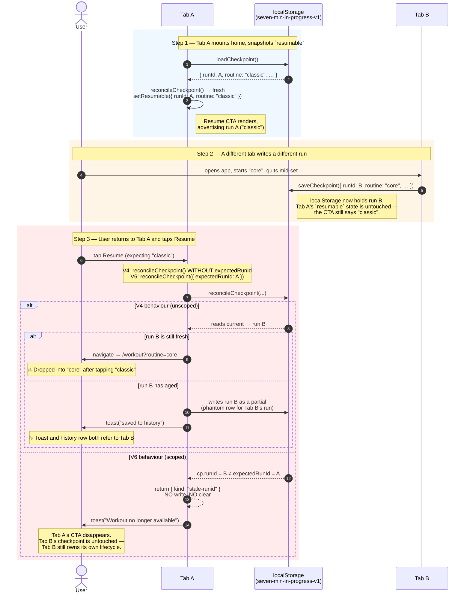

# Lessons from Closing the Multi-Tab Race

**Date:** 2026-06-04
**Case:** V6 of the "save partial workouts on quit" arc. V4 added the click-time reconcile that closed the data-correctness gap. V5 added the toast that closed the UX gap. V5's rubber-duck pass surfaced a pre-existing V4 bug — `onResume`'s click-time `reconcileCheckpoint()` wasn't scoped to `resumable.runId`, so a second tab writing a different checkpoint between Tab A's home mount and Tab A's Resume tap could either drop the user into the wrong workout or have Tab A write Tab B's run into history on Tab B's behalf. V6 closes that race with a non-mutating runId guard, a fifth `ReconcileResult` arm, and a toast that deliberately doesn't speculate about what the other tab is doing.

---

## The case in three sentences

V4's `onResume` re-reads `localStorage` at click time but doesn't check that the run it loads matches the one the CTA was rendered for, so a multi-tab interleaving can have Tab A act on Tab B's checkpoint with one of two failure modes: navigate-into-wrong-run (Tab B's run was still fresh) or toast-and-write-a-phantom-history-row (Tab B's run had aged past threshold). V6 adds an optional `expectedRunId` to `ReconcileOptions` and a `stale-runid` arm to `ReconcileResult` that returns _before any writing branch_ on mismatch, plus scopes the three internal `clearCheckpoint()` calls inside `reconcileCheckpoint` to `cp.runId` so the same race can't bite in a narrower form. The new arm is wired through `onResume`'s exhaustive switch as a fifth case with a "Workout no longer available" toast, and the V5 wording site catches it as a TypeScript error the moment the union grows — exactly the future-proofing V5 was designed to provide.

---

## The race in one diagram



---

## Angle 1 — The short-circuit goes _before_ the writing branches, not after

V6's whole correctness rests on one ordering decision: the runId mismatch check has to run before any branch that calls `saveSession()` or `clearCheckpoint()`, not after. The implementation is three lines inserted immediately after `loadCheckpoint()`'s null check:

```ts
const cp = loadCheckpoint();
if (!cp) return { kind: "none" };

if (opts.expectedRunId && cp.runId !== opts.expectedRunId) {
  return { kind: "stale-runid" };
}

// — everything below this point may write or clear —
const freshness = opts.freshnessMs ?? DEFAULT_FRESHNESS_MS;
// ...
```

The alternative — putting the check at the call site in `onResume`, after `reconcileCheckpoint` has already returned `reconciled-partial` or `reconciled-completed` — is wrong on its face: by the time the result reaches the caller, the side effects have already happened. The history row is written, the checkpoint is cleared, and there's nothing the caller can do except apologize for the row that just appeared on the wrong tab's behalf.

This is the property the rubber-duck pass cared most about. The first version of V6's plan included a `discoverResumable()` helper that would call `reconcileCheckpoint()` again at the end of the `stale-runid` branch to "refresh the CTA in place" so the user would see Tab B's run if they wanted to resume it. Finding 1 of the critique pointed out that the helper would itself be unscoped and would re-introduce the exact mutation the new arm exists to prevent — the user taps Resume, the runId guard fires correctly, and then the refresh helper writes Tab B's stale run into history anyway. The helper got dropped. The CTA disappears on `stale-runid` and the user can reload or navigate to discover whatever fresh state Tab B left behind.

The general lesson: when adding a new arm to a function that performs side effects, audit every caller for "but what about refreshing after?" patterns. A refresh that re-enters the function bypasses the very guard you just added.

---

## Angle 2 — V5's exhaustive switch earned its keep on the first new arm

V5 spent three lines on a `never`-typed default in the wording switch:

```ts
default: {
  const _exhaustive: never = result;
  void _exhaustive;
}
```

V5's lessons doc argued this was future-proofing for an arm that might never come. V6 added that arm one slice later. The compiler caught it immediately:

```
Type '{ kind: "stale-runid"; }' is not assignable to type 'never'.
```

The error pointed at the exact line that needed a new `case`, and the wording question ("what do we say to the user here?") got asked at the moment of writing rather than discovered weeks later by a confused user reporting a missing toast. The cost was three lines paid in V5; the benefit was a forced design conversation paid in V6. The conversation produced "Workout no longer available," which is wording that wouldn't have surfaced from a `default:` fallthrough.

The narrower lesson: future-proofing is cheap when the cost is three lines and the benefit is a compile error at the right site. The wider lesson: discriminated unions with `never`-default exhaustive switches are a forcing function for design conversations at the moment a new arm is added, not later when a user files a bug about it.

---

## Angle 3 — Toast wording that doesn't speculate about the other tab's intent

Three wordings were considered and rejected before landing on the fourth:

| Candidate                         | Failure mode                                                                                                                                                            |
| --------------------------------- | ----------------------------------------------------------------------------------------------------------------------------------------------------------------------- |
| "Resumed in another tab"          | Assumes Tab B is _resuming_. Wrong if Tab B started a fresh run instead.                                                                                                |
| "Workout claimed by another tab"  | Weird if Tab B started a different routine entirely. "Claimed" implies Tab B took _this_ workout; it didn't.                                                            |
| "Started a different workout"     | Assumes Tab B is _the user_. Wrong on iOS where a stale tab the user forgot about may have woken up from BFCache and written a checkpoint without the user touching it. |
| **"Workout no longer available"** | Unconditionally true regardless of what Tab B did, who is operating it, or whether anyone is operating it.                                                              |

The pattern: when the toast is reacting to state the calling tab doesn't have full visibility into, the wording should describe _the local fact_ (the workout this tab was advertising is no longer the one stored) and not infer what the other actor did. "No longer available" is the local fact: at the moment the user tapped, the workout the CTA represented was not the workout the store held. Whether Tab B is the user, a forgotten background tab, BFCache resurrection, or a multi-device sync event is unknowable from Tab A and shouldn't be encoded in the wording.

The same restraint applies to the decision _not_ to refresh the CTA after the toast. A "refresh in place" CTA would have to choose a wording too — "Resume Tab B's workout instead?" — and would inherit all the same problems plus the new one of acting on a run the local tab never reconciled. Better to drop the CTA cleanly and let a reload or navigation re-establish ground truth.

---

## Angle 4 — Scoping reconcile's internal `clearCheckpoint()` calls is the same race in miniature

`reconcileCheckpoint` has three branches that end in `clearCheckpoint()`: the completed-pending branch, the partial-write branch, and the discarded branch. All three originally called `clearCheckpoint()` unscoped. Each is the same race the new `expectedRunId` guard exists to prevent, just at a tighter scale: between `loadCheckpoint()` at the top of the function and `clearCheckpoint()` at the bottom of the branch, a different tab could have written a new checkpoint. The unscoped clear would then erase the new tab's run.

The fix is the same shape: pass the runId we loaded as the scope:

```ts
clearCheckpoint({ runId: cp.runId });
```

`clearCheckpoint` already supported a `runId` option (V4 added it for `onStartOver` and `onDiscard`). The implementation reads:

```ts
function clearCheckpoint(opts: { runId?: string } = {}) {
  // ...
  if (opts.runId) {
    const cp = loadCheckpoint();
    if (cp && cp.runId !== opts.runId) return;
  }
  localStorage.removeItem(CHECKPOINT_KEY);
}
```

So a scoped clear that loads a different run does nothing instead of erasing it. Three lines of edit, three calls scoped, race closed.

This was Finding 2 of the V6 rubber-duck pass — explicitly a "free win" find, not a blocker. The interesting thing about it is that the same code shape (`loadCheckpoint()` at one moment, `localStorage.removeItem()` at a later moment) was present in three different branches of a function whose whole job was to be the canonical reconciler. The race the function exists to handle had been embedded inside the function's own implementation. The lesson: when adding a `runId` option to a high-level operation, audit any lower-level operation it calls that also touches the same storage key. The scope needs to propagate down or the guarantee leaks.

---

## Angle 5 — Verification matrix matters more than verification count

The V5 manual verification was three cases (happy, stale-aged, none). V6 expanded to seven (four Tab-B-state cases for the new non-mutation property plus the three V5 regressions). The size of the matrix matters less than its shape: the four B-cases all assert the same five things (toast text, CTA gone, checkpoint byte-identical, sessions length unchanged, no navigation) against four different Tab-B states (fresh-different-routine, stale-above-threshold, completed-pending, 0-completed-fresh). Each Tab-B state corresponds to a different writing branch in `reconcileCheckpoint` — exactly the branches the runId guard is designed to short-circuit.

The matrix is what catches "guard works on the easy path but a different branch sneaks past it." A single test against `fresh-different-routine` would have passed even if the guard had been placed after the completed-pending branch, because the completed-pending branch wouldn't be exercised by a fresh checkpoint. The B3 case (Tab B's checkpoint has `completedExercises >= totalExercises`) is the one that would have caught a guard-too-late bug, and it was the rubber-duck Finding 5 that prompted me to add it.

The Playwright harness for the matrix was a small helper that takes a Tab-B state, mutates `localStorage`, clicks Resume, and polls for the toast text in tight succession (`setTimeout(r, 10)` × 50 iterations) — necessary because the 2-second toast often auto-dismissed before a delayed query could see it. The first attempt missed the toast text for that reason and only the side-effect assertions (CTA gone, checkpoint preserved) caught the win. The toast-text capture is the assertion that defends the wording choice; the side-effect assertions defend the correctness. Both are worth having.

---

## Patterns

- **The short-circuit goes before the writing branches, not after.** A non-mutating new arm has to return before any side-effect line in the function, or the caller is just being told about damage that's already done.
- **Audit refresh-in-place loops when adding a new arm to a side-effecting function.** A `re-call` after the new arm bypasses the guard you just added. The V6 plan briefly included a `discoverResumable()` helper; it was correctly killed.
- **Toast wording describes the local fact, not the inferred remote intent.** "No longer available" is locally true. "Resumed in another tab" assumes the other actor is the user, is resuming, and chose the same routine — none of which is knowable from this tab.
- **Propagate scope arguments down the call stack.** When a high-level op gets a `runId` scope, every lower-level op it calls that touches the same key needs the scope too. The guarantee leaks otherwise.
- **A `never`-default exhaustive switch is a forcing function for design conversations.** The next slice that adds an arm to the union gets a compile error at the wording site, asking "what do we say here?" at the moment it can be answered cheaply.
- **Verification matrix shape > verification count.** Four cases that each exercise a different writing branch beats forty cases that all exercise the same one. The matrix is for catching "the guard works on the easy path but not the next one."

---

## Antipatterns

- **Adding a new `ReconcileResult` arm and letting it fall through to the existing wording.** The user gets the wrong message; the wording was chosen for a different branch. The exhaustive switch is what prevents this.
- **"Refreshing" stale UI state by re-calling the side-effecting function that produced it.** The new guard you just added is invisible to the refresh path; the bug re-enters through the back door.
- **Toasting the inferred intent of another actor.** "Started a different workout in another tab" is wrong on iOS BFCache wake-up where no user action occurred. Describe the local fact and stop.
- **Scoping a top-level operation by `runId` but leaving its internal clears unscoped.** The race the scope was added to prevent is still present inside the function's own implementation.
- **Skipping the writing-branch-coverage matrix because the easy case passes.** B1 alone would have masked a guard placed after the completed-pending branch; B3 was the case that would have failed.
- **Polling for toast text after the toast has auto-dismissed.** A 2-second receipt is gone before a 500ms-delayed query can see it; capture inside a tight polling loop or extend the duration for the test.

---

## Open questions

- **Is the V6 guard sufficient, or does the reconcile-then-act sequence need atomicity?** V6 makes the runId mismatch a non-mutating return, but the writing branches that follow it still do a `loadCheckpoint`-at-top / `clearCheckpoint`-at-bottom dance that could in theory be interleaved by another tab's write between the load and the write. The window is microseconds and a real user can't trigger it; left unfixed for now. A `localStorage` `Lock`-style API would close it, but the cost (a polyfill or a coarser-grained lock) seems disproportionate to the residual risk.
- **Should the home page subscribe to `storage` events?** If Tab B writes a new checkpoint, Tab A's home page currently doesn't know — the CTA stays stale until a reload or until the user taps and gets V6's toast. A `window.addEventListener('storage', …)` listener that re-runs the mount-time reconcile would keep the CTA in sync across tabs. Not in V6's scope; tracked for a future slice.
- **Should the "Workout no longer available" toast offer a "View workout" action that navigates into Tab B's run?** Tempting, but it inherits the "act on a run this tab never reconciled" problem. Better answer is probably the storage-event listener above, which would naturally re-render the CTA for Tab B's run if it's fresh.

---

## Resolves from V5

V5's lessons doc left this as the open question:

> Should the multi-tab race on `onResume`'s click-time reconcile get fixed? The rubber-duck pass on V5 surfaced a pre-existing V4 bug: `reconcileCheckpoint()` at click time isn't scoped to `resumable.runId`, so a second tab that wrote a new checkpoint between Tab A's home mount and Tab A's Resume tap could cause Tab A to either (a) navigate into the wrong workout if the new checkpoint is fresh, or (b) toast "saved to history" referring to the wrong run if it's stale.

V6 answers: yes, fixed with `expectedRunId` + a `stale-runid` arm + non-mutating short-circuit before any writing branch. The toast wording for the new arm is "Workout no longer available" — describing the local fact without speculating about Tab B's intent. The internal-clear race (Finding 2 of V6's own rubber-duck pass) got fixed in the same slice as a free win.

---

## TL;DR

- V6 closes the pre-existing multi-tab race V5's rubber-duck flagged: `reconcileCheckpoint` now accepts `expectedRunId` and returns a non-mutating `stale-runid` arm when the loaded checkpoint's runId doesn't match the caller's expectation.
- The guard fires _before_ any writing branch — adding it after would mean the side effects had already happened by the time the caller could react. The first plan had a `discoverResumable()` refresh helper that would have re-introduced the bug via an unscoped re-entry; the rubber-duck pass killed it.
- V5's `never`-typed exhaustive switch in `onResume` caught the new arm as a TypeScript error and forced the wording conversation at the right moment. "Workout no longer available" is unconditionally true regardless of what the other tab did, who is operating it, or whether anyone is operating it.
- The three internal `clearCheckpoint()` calls inside `reconcileCheckpoint` got scoped to `cp.runId` in the same slice — the same race in miniature, fixed by propagating the scope down one level.
- Verification was a four-state Tab-B non-mutation matrix plus three V5 regression cases; the matrix shape (each Tab-B state exercises a different writing branch) is what catches a guard placed too late, not the matrix size.
- Open questions: storage-event listener for cross-tab CTA freshness; whether the residual microsecond-window load/write race needs a Lock-style API (probably no).

— Goodfellow
